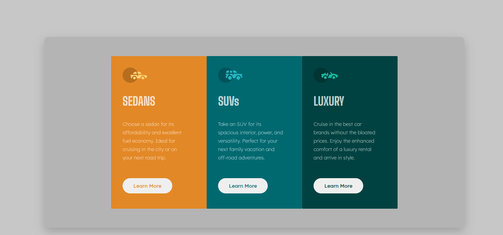

# Card Component 🚗

Projeto de um componente de cards desenvolvido com **HTML e CSS**, inspirado em um desafio de frontend.

## 🖼️ Preview

## 🛠️ Tecnologias

* HTML5
* CSS3
* Flexbox

## 📋 Sobre o projeto

O objetivo deste projeto foi praticar a criação de layouts com Flexbox, estilização de componentes, responsividade, efeitos de `hover` e organização do código CSS.

O layout apresenta três cards com diferentes categorias de veículos, cada um com seu conteúdo e estilo.

## 📱 Responsividade

O projeto foi desenvolvido para se adaptar a diferentes tamanhos de tela, proporcionando uma boa experiência em dispositivos móveis e desktops.

## 🔗 Projeto

[GitHub](https://github.com/MileneGeraldo98/Card-Component)

## 👩‍💻 Autora

**Milene Geraldo**
